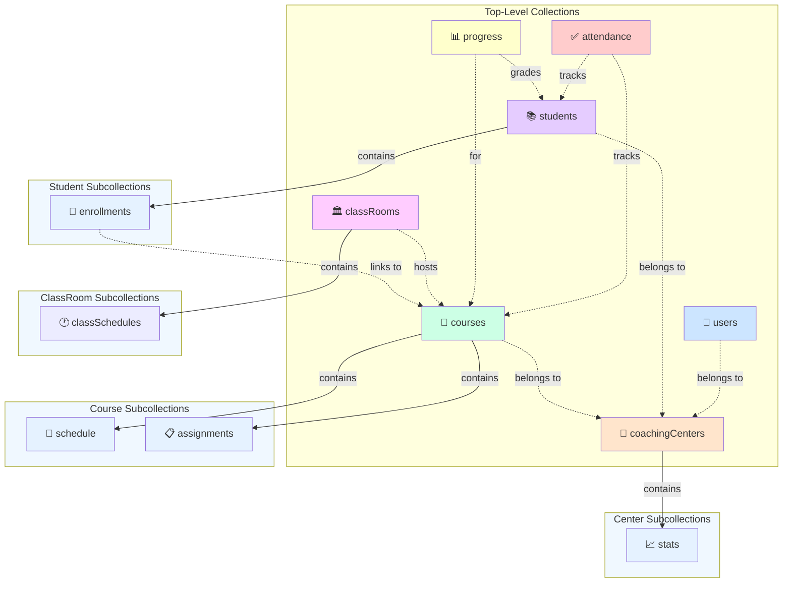
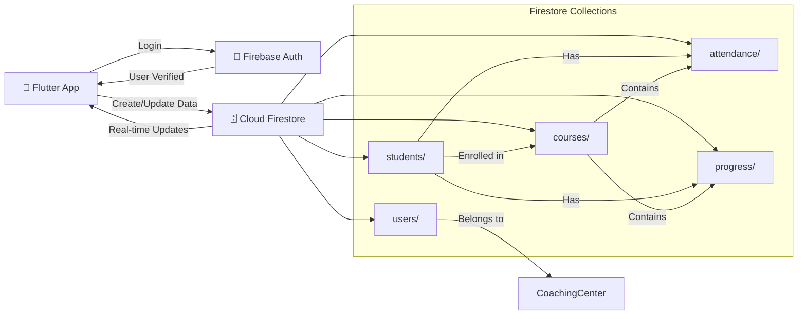
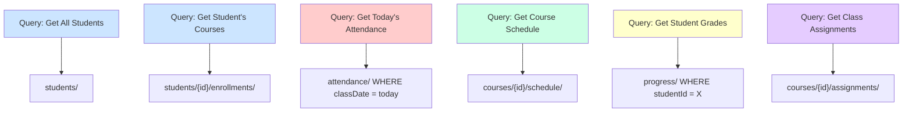
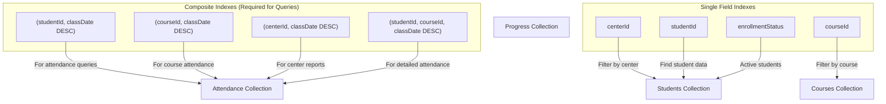
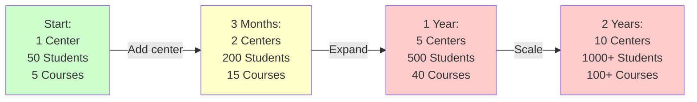
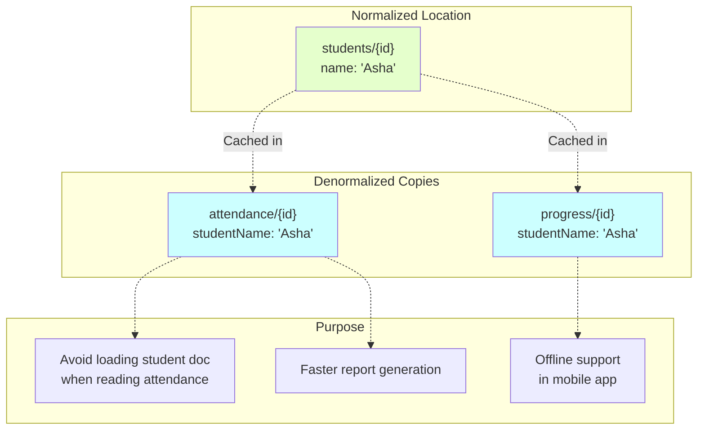

# EduTrack Firestore Schema - Visual Diagrams

## Interactive Entity Relationship Diagram



---

## Detailed Collection Hierarchy

### 1. CoachingCenters Collection Tree

```
coachingCenters/
├── centerId: "center_001"
│   ├── name: "Sharma Coaching Center"
│   ├── address: "123 Main St, Jaipur"
│   ├── adminUserId: "user_001"
│   ├── totalStudents: 45
│   ├── activeCourses: 8
│   ├── createdAt: timestamp
│   └── stats/ (Subcollection)
│       ├── 2024-02-03
│       │   ├── totalAttendance: 40
│       │   ├── totalAbsent: 5
│       │   └── averageAttendance: 88.9%
│       ├── 2024-02-02
│       │   └── (previous day stats)
│       └── ...
│
└── centerId: "center_002"
    ├── name: "Kumar Institute"
    └── (same structure)
```

### 2. Users Collection Tree

```
users/
├── userId: "user_teacher_001"
│   ├── email: "rajesh.kumar@gmail.com"
│   ├── displayName: "Rajesh Kumar"
│   ├── role: "teacher"
│   ├── centerId: "center_001"
│   ├── departmentAssigned: "Mathematics"
│   ├── isActive: true
│   ├── createdAt: timestamp
│   └── lastLogin: timestamp
│
├── userId: "user_admin_001"
│   ├── email: "admin@center.com"
│   ├── displayName: "Admin User"
│   ├── role: "admin"
│   ├── centerId: "center_001"
│   └── (other fields)
│
└── userId: "user_coord_001"
    ├── role: "coordinator"
    └── (other fields)
```

### 3. Students Collection Tree (Complex)

```
students/
├── studentId: "stu_001"
│   ├── rollNumber: "STU-2024-001"
│   ├── firstName: "Asha"
│   ├── lastName: "Sharma"
│   ├── email: "asha@example.com"
│   ├── gender: "F"
│   ├── centerId: "center_001"
│   ├── enrollmentStatus: "active"
│   ├── joiningDate: timestamp
│   ├── totalAttendancePercentage: 92.5
│   ├── averageScore: 87.3
│   ├── createdAt: timestamp
│   └── enrollments/ (Subcollection)
│       ├── enrollmentId: "enroll_001"
│       │   ├── courseId: "course_math_001"
│       │   ├── courseName: "Mathematics - Class 10"
│       │   ├── status: "active"
│       │   ├── currentGrade: "A"
│       │   ├── scorePercentage: 87.3
│       │   └── attendancePercentage: 92.5
│       │
│       ├── enrollmentId: "enroll_002"
│       │   ├── courseId: "course_physics_001"
│       │   ├── courseName: "Physics - Class 10"
│       │   ├── status: "active"
│       │   ├── currentGrade: "B"
│       │   └── scorePercentage: 82.1
│       │
│       └── enrollmentId: "enroll_003"
│           └── (more courses)
│
├── studentId: "stu_002"
│   ├── firstName: "Rajesh"
│   └── enrollments/
│       └── (multiple courses)
│
└── (more students with their enrollments)
```

### 4. Courses Collection Tree

```
courses/
├── courseId: "course_math_001"
│   ├── name: "Mathematics - Class 10"
│   ├── subject: "Mathematics"
│   ├── instructorId: "user_teacher_001"
│   ├── level: "Class 10"
│   ├── capacity: 30
│   ├── enrolledCount: 24
│   ├── startDate: timestamp
│   ├── endDate: timestamp
│   ├── createdAt: timestamp
│   ├── schedule/ (Subcollection - Class Sessions)
│   │   ├── class_001
│   │   │   ├── classDate: 2024-02-03
│   │   │   ├── startTime: 09:00 AM
│   │   │   ├── endTime: 10:30 AM
│   │   │   ├── room: "Room A-101"
│   │   │   ├── topic: "Linear Equations"
│   │   │   └── isCompleted: true
│   │   │
│   │   ├── class_002
│   │   │   ├── classDate: 2024-02-04
│   │   │   ├── startTime: 09:00 AM
│   │   │   └── (other fields)
│   │   │
│   │   └── (more classes)
│   │
│   └── assignments/ (Subcollection)
│       ├── assign_001
│       │   ├── title: "Algebra Problem Set 1"
│       │   ├── dueDate: 2024-02-10
│       │   ├── type: "homework"
│       │   ├── totalMarks: 50
│       │   └── submissionCount: 18
│       │
│       ├── assign_002
│       │   ├── title: "Geometry Project"
│       │   ├── type: "project"
│       │   └── (other fields)
│       │
│       └── (more assignments)
│
├── courseId: "course_physics_001"
│   ├── name: "Physics - Class 10"
│   └── (similar structure)
│
└── (more courses)
```

### 5. Attendance Collection Tree (Time-Series)

```
attendance/
├── attendanceId: "att_001"
│   ├── studentId: "stu_001"
│   ├── studentName: "Asha Sharma"
│   ├── courseId: "course_math_001"
│   ├── courseName: "Mathematics - Class 10"
│   ├── centerId: "center_001"
│   ├── classDate: 2024-02-03 (DATE)
│   ├── status: "present"
│   ├── markedBy: "user_teacher_001"
│   ├── markedAt: 2024-02-03 09:05 AM
│   └── remarks: null
│
├── attendanceId: "att_002"
│   ├── studentId: "stu_002"
│   ├── studentName: "Rajesh Kumar"
│   ├── courseId: "course_math_001"
│   ├── classDate: 2024-02-03
│   ├── status: "absent"
│   └── remarks: "Medical appointment"
│
├── attendanceId: "att_003"
│   ├── studentId: "stu_001"
│   ├── courseId: "course_physics_001"
│   ├── classDate: 2024-02-03
│   ├── status: "late"
│   └── (other fields)
│
├── attendanceId: "att_004"
│   ├── studentId: "stu_001"
│   ├── courseId: "course_math_001"
│   ├── classDate: 2024-02-02
│   ├── status: "present"
│   └── (previous day)
│
└── (100,000s+ more records organized by date)
```

### 6. Progress Collection Tree (Grades & Scores)

```
progress/
├── progressId: "prog_001"
│   ├── studentId: "stu_001"
│   ├── studentName: "Asha Sharma"
│   ├── courseId: "course_math_001"
│   ├── courseName: "Mathematics - Class 10"
│   ├── assessmentType: "unit_test"
│   ├── assessmentTitle: "Unit Test 1 - Algebra"
│   ├── totalMarks: 100
│   ├── obtainedMarks: 87
│   ├── scorePercentage: 87.0
│   ├── grade: "A"
│   ├── comments: "Excellent work"
│   ├── evaluatedBy: "user_teacher_001"
│   ├── evaluatedAt: 2024-01-25
│   └── isPublished: true
│
├── progressId: "prog_002"
│   ├── studentId: "stu_001"
│   ├── courseId: "course_math_001"
│   ├── assessmentType: "monthly_exam"
│   ├── assessmentTitle: "January Monthly Exam"
│   ├── totalMarks: 100
│   ├── obtainedMarks: 85
│   └── (other fields)
│
├── progressId: "prog_003"
│   ├── studentId: "stu_002"
│   ├── courseId: "course_math_001"
│   ├── assessmentType: "unit_test"
│   └── (other fields)
│
└── (1000s+ records per semester)
```

### 7. ClassRooms Collection Tree

```
classRooms/
├── classRoomId: "room_001"
│   ├── name: "Room A-101"
│   ├── capacity: 40
│   ├── location: "Building A, Floor 1"
│   ├── centerId: "center_001"
│   ├── resources: ["projector", "whiteboard", "AC"]
│   ├── isActive: true
│   └── classSchedules/ (Subcollection)
│       ├── schedule_001
│       │   ├── courseId: "course_math_001"
│       │   ├── dayOfWeek: "Monday"
│       │   ├── startTime: 09:00 AM
│       │   ├── endTime: 10:30 AM
│       │   └── isActive: true
│       │
│       ├── schedule_002
│       │   ├── courseId: "course_math_001"
│       │   ├── dayOfWeek: "Wednesday"
│       │   └── (other times)
│       │
│       └── (more schedules)
│
├── classRoomId: "room_002"
│   ├── name: "Room B-201"
│   └── (similar structure)
│
└── (more rooms)
```

---

## Data Flow Diagram



---

## Collection Query Patterns



---

## Write Operations Diagram

```mermaid
graph LR
    TEA["👨‍🏫 Teacher"]
    APP["📱 App"]
    DB["🗄️ Firestore"]
    
    TEA -->|Mark Attendance| APP
    APP -->|Write attendance doc| DB
    
    TEA -->|Enter Grade| APP
    APP -->|Write progress doc| DB
    
    TEA -->|Update Course| APP
    APP -->|Update courses/{id}| DB
    
    ADM["👨‍💼 Admin"]
    ADM -->|Create Student| APP
    APP -->|Create students/{id}| DB
    
    style TEA fill:#FFE5CC
    style ADM fill:#E5CCFF
    style APP fill:#CCE5FF
    style DB fill:#FFFFCC
```

---

## Indexing Strategy



---

## Scaling Growth Model



---

## Denormalization Strategy



---

## Storage Estimation for 1 Year

| Collection | Records | Avg Doc Size | Storage |
|------------|---------|--------------|---------|
| coachingCenters | 5 | 1 KB | 5 KB |
| users | 50 | 2 KB | 100 KB |
| students | 500 | 5 KB | 2.5 MB |
| courses | 40 | 3 KB | 120 KB |
| enrollments (subcollection) | 2,500 | 1 KB | 2.5 MB |
| attendance | 270,000 | 0.8 KB | 216 MB |
| progress | 15,000 | 1.5 KB | 22.5 MB |
| classRooms | 20 | 2 KB | 40 KB |

**Total Est. Storage: ~246 MB for 1 center with 500 students over 1 year**

*(Firestore provides 1 GB free storage/month, so well within limits)*

---

## Next Steps for Implementation

1. ✅ **Schema Design** (This document)
2. 📋 **Security Rules** - Define Firebase Security Rules
3. 🔧 **CRUD Operations** - Implement Create, Read, Update, Delete functions
4. 🏗️ **Data Models** - Create Dart classes for type safety
5. 🎨 **UI Integration** - Connect widgets to Firestore
6. 📊 **Real-time Listeners** - Setup StreamBuilders for live updates
7. 🧪 **Testing** - Unit and integration tests

